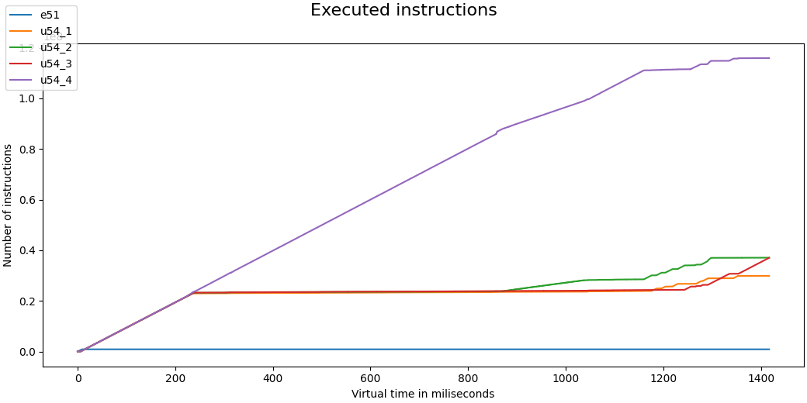

# Metrics analyzer

Renode enables collecting execution data from the simulation and allows profiling the execution itself.
Currently supported execution metrics:

-   executed instructions,
-   memory accesses,
-   peripheral accesses,
-   exceptions.

## Profiling

To enable profiling in Renode, type:

```
(monitor) machine EnableProfiler "path_to_dump_file"
```

Run the simulation. The profiler is now collecting data from the metrics. Close Renode once this step is finished.
As a result, you will get a dump file with collected metrics.

The dump can be analyzed using the {rsrc}`metrics_parser Python library<tools/metrics_analyzer/metrics_parser/__init__.py>` or visualised with the provided helper script.

## Visualizing

To display graph representations of the collected data by means of the visualizer bundled with Renode follow these steps:

### Additional prerequisites

To install prerequisites for the metrics visualization layer, run the following command from the root Renode directory :

```sh
python3 -m pip install --user -r tools/metrics_analyzer/metrics_visualizer/requirements.txt
```

### Run script

Run the following script:

```sh
python3 tools/metrics_analyzer/metrics_visualizer/metrics-visualizer.py path_to_dump_file
```

As a result, a window with graphs should appear, similar to the one presented below.


