# Supported boards

Renode supports a wide array of hardware platforms, covering multiple architectures, CPU families and providing various I/O capabilities.

You can see a summary of over 400 IoT development boards supported as part of the [Zephyr dashboard effor](https://zephyr-dashboard.renode.io/) and learn more about them in [Renodepedia](https://zephyr-dashboard.renode.io/renodepedia/).

In Renodepedia, you can see pre-executed runs of different embedded software binaries as well as use the available artifacts to run the demos yourself.

On top of that, this chapter contains an (incomplete) list of selected supported hardware targets with dedicated demos - all of these include sample software binaries that run both on real hardware and in Renode.

To run example software on any of the below boards, simply run Renode and use:

```none
s @scripts/PATH/TO/SCRIPT-NAME.resc
```

Tab completion is available also for filenames, so be sure to explore the available demos.

The ultimate goal of Renode is to run any binary-compatible software targeted for any of those hardware platforms without modification, although of course your specific use case may require extending the provided hardware description / models.

Boards supported in this way include:

<style>
.boards-table { table-layout: fixed; width: 100% }
.boards-table .sd-card { text-align: center !important }
.boards-table td { white-space: normal !important }
.boards-table img { object-fit: scale-down; height: 300px !important }
</style>

::::{list-table}
:align: center
:class: boards-table

* - :::{card} [ST Micro STM32 Nucleo-64](https://www.st.com/en/evaluation-tools/nucleo-f103rb.html)

    
    +++
    {script}`stm32f4_discovery.resc<single-node/stm32f4_discovery.resc>`
    :::

  - :::{card} [ST Micro STM32F4 Discovery](https://www.st.com/en/evaluation-tools/stm32f4discovery.html)

    
    +++
    {script}`stm32f4_discovery.resc<single-node/stm32f4_discovery.resc>`
    :::

  - :::{card} [ST Micro STM32F7 Discovery](https://www.st.com/en/evaluation-tools/32f746gdiscovery.html)

    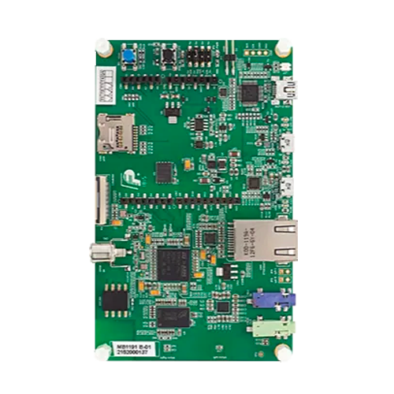
    +++
    {script}`stm32f746.resc<single-node/stm32f746.resc>`
    :::

* - :::{card} [SiLabs EFR32 Mighty Gecko Wireless Starter Kit](https://www.silabs.com/products/development-tools/wireless/mesh-networking/mighty-gecko-starter-kit)

    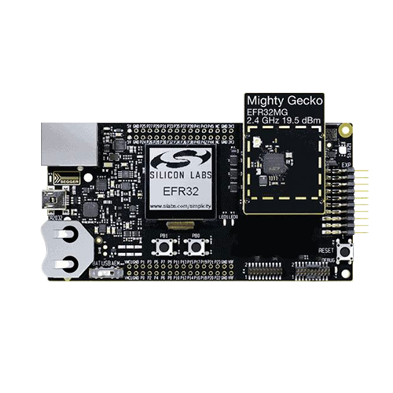
    +++
    {script}`efr32mg.resc<single-node/efr32mg.resc>`
    :::

  - :::{card} [Microchip SAM E70 Xplained Evaluation Kit](https://www.microchip.com/DevelopmentTools/ProductDetails/PartNO/ATSAME70-XPLD)

    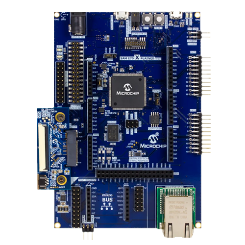
    +++
    {script}`sam_e70.resc<single-node/sam_e70.resc>`
    :::

  - :::{card} [TI CC2538 Development Kit](http://www.ti.com/tool/CC2538DK)

    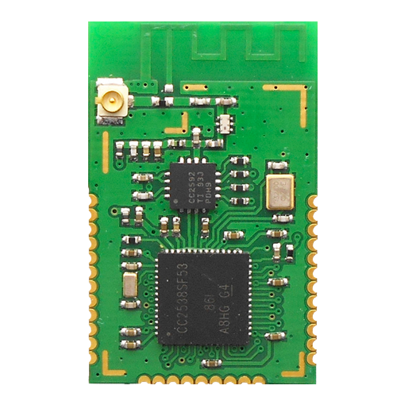
    +++
    {script}`cc2538.resc<single-node/cc2538.resc>`
    :::

* - :::{card} [SiFive HiFive1](https://www.sifive.com/boards/hifive1)

    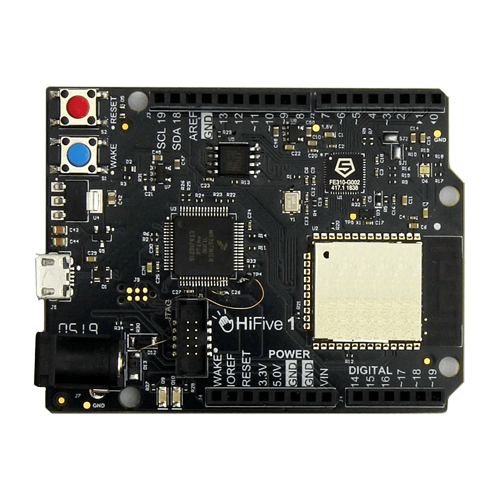
    +++
    {script}`sifive_fe310.resc<single-node/sifive_fe310.resc>`
    :::

  - :::{card} [SiFive HiFive Unleashed](https://www.sifive.com/boards/hifive-unleashed)

    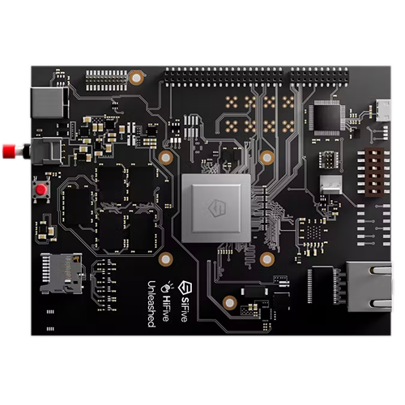
    +++
    {script}`hifive_unleashed.resc<single-node/hifive_unleashed.resc>`
    :::

  - :::{card} [Microchip PolarFire SoC Hardware Development Platform](https://www.microsemi.com/product-directory/soc-fpgas/5498-polarfire-soc-fpga#getting-started)

    
    +++
    {script}`polarfire-soc.resc<single-node/polarfire-soc.resc>`
    :::

* - :::{card} [Toradex Colibri T30](https://www.toradex.com/computer-on-modules/colibri-arm-family/nvidia-tegra-3)

    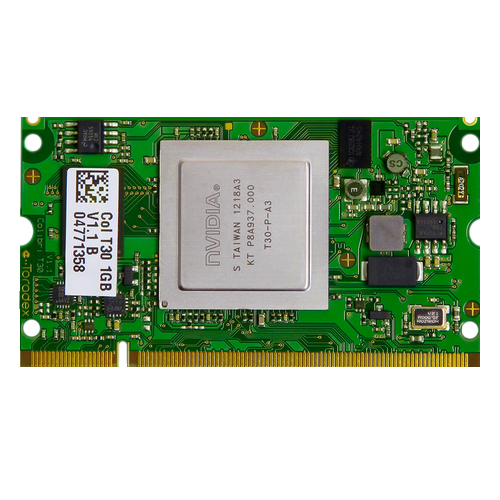
    +++
    {script}`tegra3.resc<single-node/tegra3.resc>`
    :::

  - :::{card} [OpenISA VEGAboard](https://open-isa.org/)

    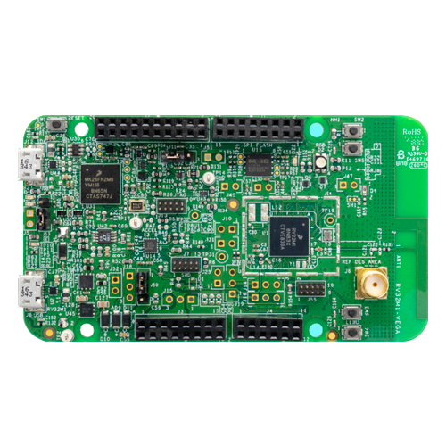
    +++
    {script}`vegaboard_ri5cy.resc<single-node/vegaboard_ri5cy.resc>`
    :::

  - :::{card} [Intel Quark SE Microcontroller Evaluation Kit C1000](https://click.intel.com/edc/intel-quark-se-microcontroller-evaluation-kit-c1000.html)

    
    +++
    {script}`quark_c1000.resc<single-node/quark_c1000.resc>`
    :::

* - :::{card} [Fomu](https://tomu.im/fomu.html)

    
    +++
    {script}`renode_etherbone_fomu.resc<complex/fomu/renode_etherbone_fomu.resc>`
    :::

  - :::{card} [LiteX/VexRiscv](https://github.com/litex-hub/linux-on-litex-vexriscv) on [Digilent Arty](https://reference.digilentinc.com/reference/programmable-logic/arty/start)

    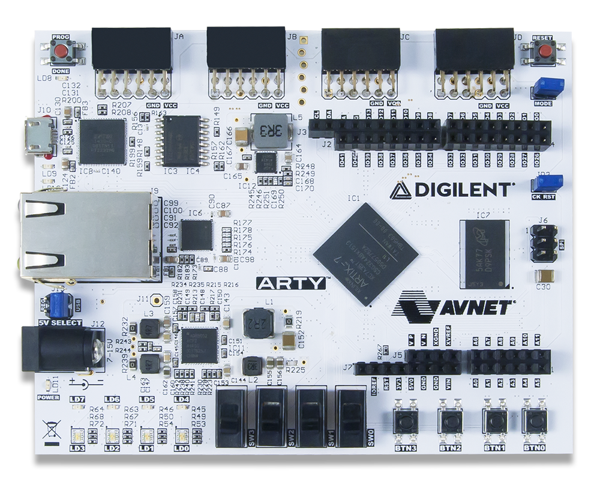
    +++
    {script}`arty_litex_vexriscv.resc<single-node/arty_litex_vexriscv.resc>`
    :::

  - :::{card} [Xilinx ZedBoard](http://www.zedboard.org/product/zedboard)

    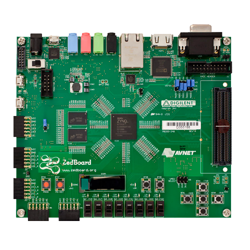
    +++
    {script}`zedboard.resc<single-node/zedboard.resc>`
    :::

* - :::{card} [ST Micro STM32F103 Blue Pill](https://stm32-base.org/boards/STM32F103C8T6-Blue-Pill)

    
    +++
    {script}`stm32f103.resc<single-node/stm32f103.resc>`
    :::

  - :::{card} [Kendryte K210](https://www.seeedstudio.com/Sipeed-MAix-BiT-for-RISC-V-AI-IoT-p-2872.html)

    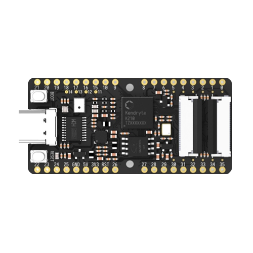
    +++
    {script}`kendryte_k210.resc<single-node/kendryte_k210.resc>`
    :::

  - :::{card} [Zolertia Firefly](https://zolertia.io/product/firefly/)

    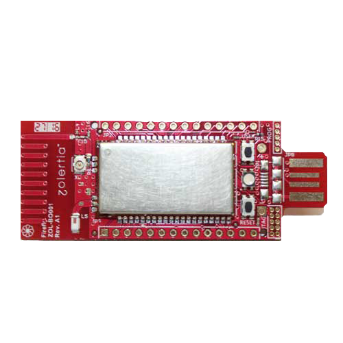
    +++
    {script}`zolertia.resc<single-node/zolertia.resc>`
    :::

* - :::{card} [QuickFeather Development Kit](https://www.quicklogic.com/products/eos-s3/quickfeather-development-kit/)

    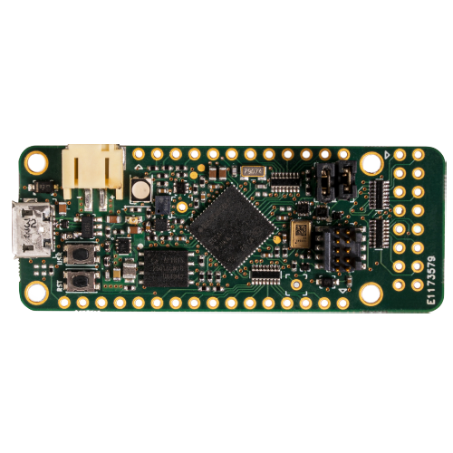
    +++
    {script}`quickfeather.resc<single-node/quickfeather.resc>`
    :::

  - :::{card} [OpenPOWER Microwatt](https://github.com/antonblanchard/microwatt) on [Digilent Nexys Video](https://reference.digilentinc.com/reference/programmable-logic/nexys-video/start)

    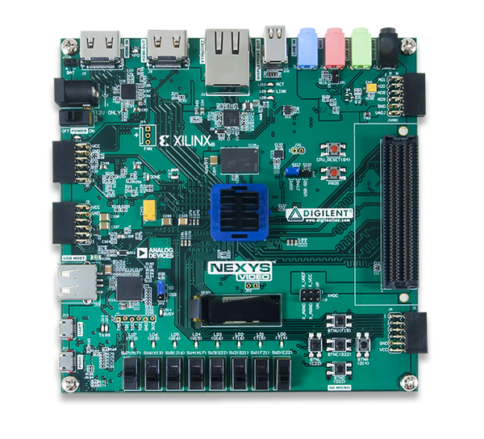
    +++
    {script}`microwatt.resc<single-node/microwatt.resc>`
    :::

  - :::{card} [Microchip PolarFire SoC Icicle Kit](https://www.microsemi.com/product-directory/soc-fpgas/5498-polarfire-soc-fpga)

    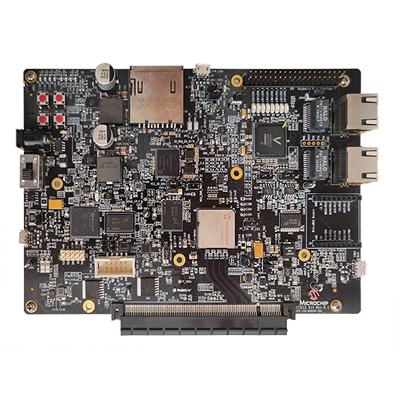
    +++
    {script}`icicle-kit.resc<single-node/icicle-kit.resc>`
    :::

* - :::{card} [Nordic nRF52840 Development Kit](https://www.nordicsemi.com/Software-and-Tools/Development-Kits/nRF52840-DK)

    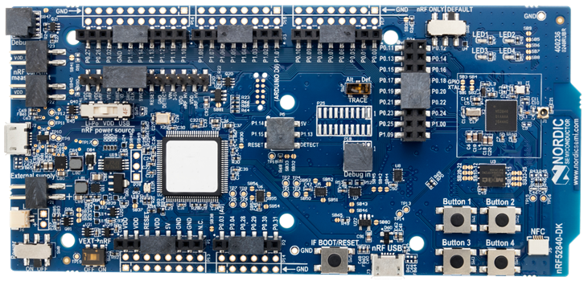
    +++
    [nRF52840.repl](https://github.com/renode/renode/blob/master/platforms/cpus/nrf52840.repl)
    :::

  - :::{card} [NXP FRDM-K64F](https://www.nxp.com/design/development-boards/freedom-development-boards/mcu-boards/freedom-development-platform-for-kinetis-k64-k63-and-k24-mcus:FRDM-K64F)

    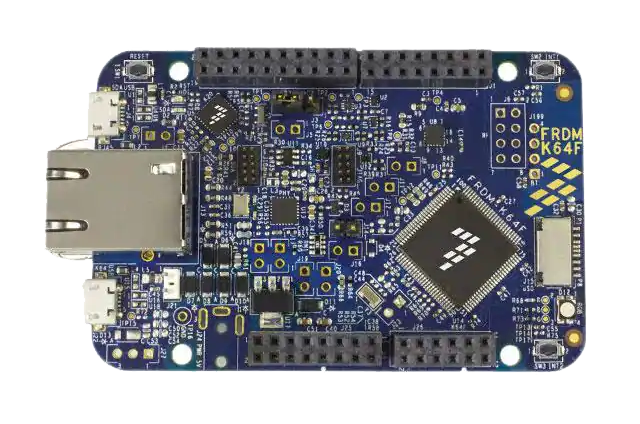
    +++
    [nxp_k64f.repl](https://github.com/renode/renode/blob/master/platforms/cpus/nxp-k6xf.repl)
    :::

  - :::{card} [Arduino Nano 33 BLE](https://store.arduino.cc/arduino-nano-33-ble)

    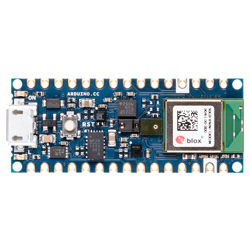
    +++
    [arduino_nano_33_ble.repl](https://github.com/renode/renode/blob/master/platforms/boards/arduino_nano_33_ble.repl)
    :::

* - :::{card} [iCE40 Ultra Plus MDP](http://www.latticesemi.com/products/developmentboardsandkits/ice40ultraplusmobiledevplatform)

    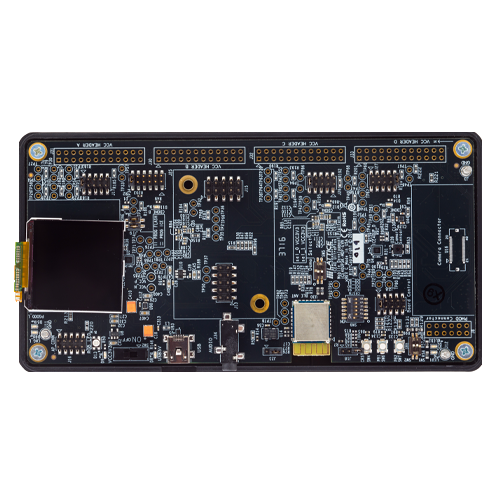
    +++
    [ice40up5k-mdp-evn.repl](https://github.com/renode/renode/blob/master/platforms/boards/ice40up5k-mdp-evn.repl)
    :::

  - :::{card} [CrossLink-NX Evaluation Board](https://www.latticesemi.com/en/Products/DevelopmentBoardsAndKits/CrossLink-NXEvaluationBoard)

    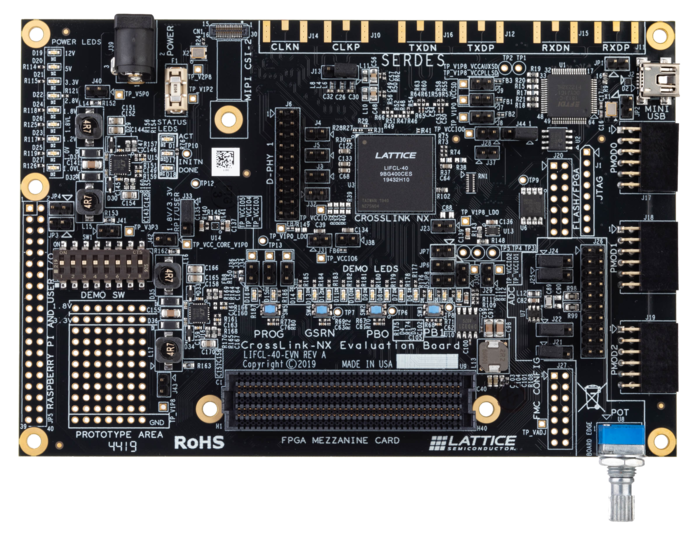
    +++
    [crosslink-nx-evn.repl](https://github.com/renode/renode/blob/master/platforms/boards/crosslink-nx-evn.repl)
    :::

  - :::{card} [NXP i.MX RT1064 Evaluation Kit](https://www.nxp.com/design/development-boards/i-mx-evaluation-and-development-boards/mimxrt1064-evk-i-mx-rt1064-evaluation-kit:MIMXRT1064-EVK)

    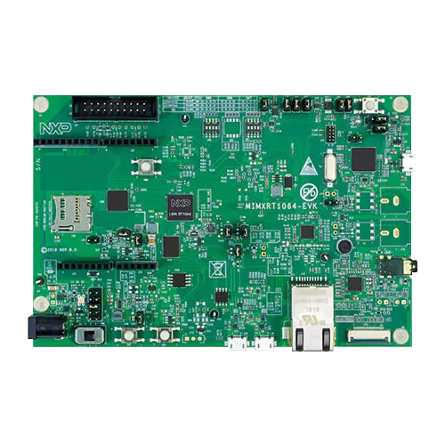
    +++
    [imxrt1064.repl](https://github.com/renode/renode/blob/master/platforms/cpus/imxrt1064.repl)
    :::

* - :::{card} [BeagleV StarLight](https://beagleboard.org/beaglev)

    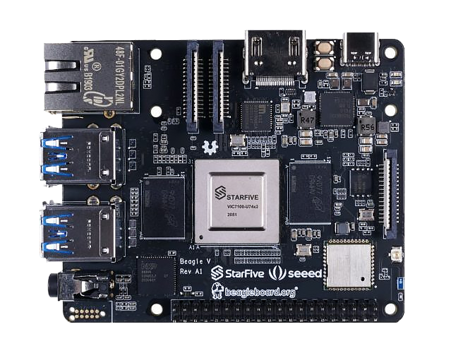
    +++
    {script}`beaglev_starlight.resc<single-node/beaglev_starlight.resc>`
    :::

  - :::{card} [ARVSOM - Antmicro RISC-V System on Module](https://github.com/antmicro/arvsom)

    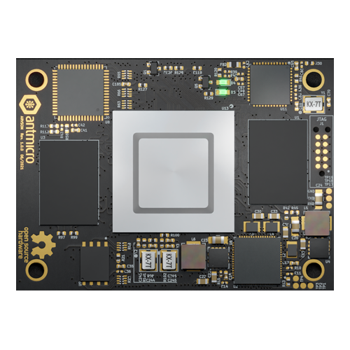
    +++
    {script}`arvsom.resc<single-node/arvsom.resc>`
    :::

  - :::{card} [GR716 Development Board](https://www.gaisler.com/index.php/products/boards/gr716-boards)

    
    +++
    {script}`gr716_zephyr.resc<single-node/gr716_zephyr.resc>`
    :::

* - :::{card} [MAX32652 Evaluation Kit](https://www.maximintegrated.com/en/products/microcontrollers/MAX32650-EVKIT.html)

    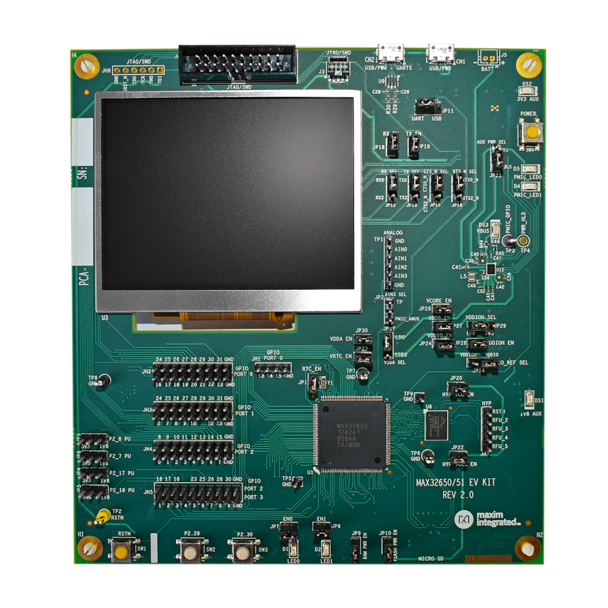
    +++
    {script}`max32652-evkit.resc<single-node/max32652-evkit.resc>`
    :::

  -

  -
::::

There are of course more, and new ones are being added quickly - Renode makes it easy to create your own platform which reuses the same peripherals / CPUs that exist in other platforms.

We provide commerical services to add new platforms - if you need help in this regard, please write to [support@renode.io](mailto:support@renode.io).

# Supported peripherals

<style>
  .peripherals-table tr {
      height: 2em;
   }
  .peripherals-table td,
  .peripherals-table th {
      border: 1px solid grey;
      border-top: 0px;
      vertical-align: middle;
  }
  .peripherals-table {
      margin-top: 20px;
      border-top: 1px solid grey;
  }
  .peripherals-table table {
      margin-top: 0px!important;
  }
</style>

:::{include} renode_supported_peripherals.html
:::
